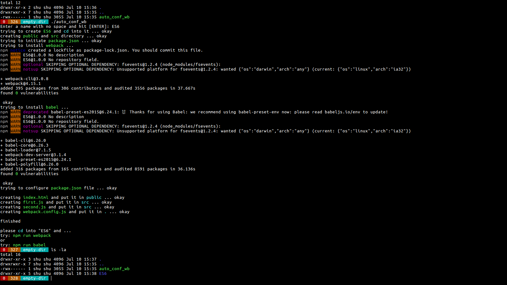
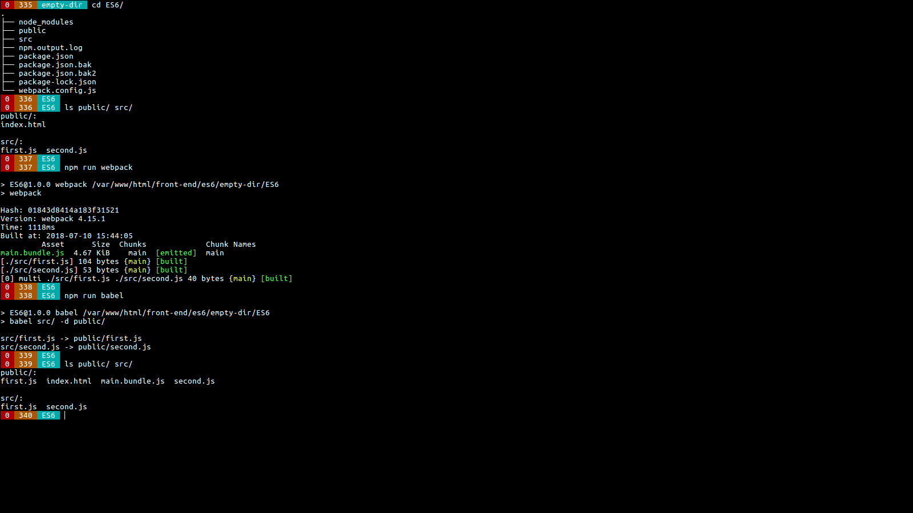

# auto_conf_wb
auto configure webpack and babel

Since installing `` and `` can be a real headache I created this simple `` script so they everything can be set up automatically

The only thing you need is

 - `git clone https://github.com/k-five/auto_conf_wb`
 - `cd auto_conf_wb`
 - `chmod 700 auto_conf_wb`

Then run it anywhere you want like so:

 - `./auto_conf_wb`

It will ask you for a name, enter the name and sit back. Then at the end try it.

# screen-shots

